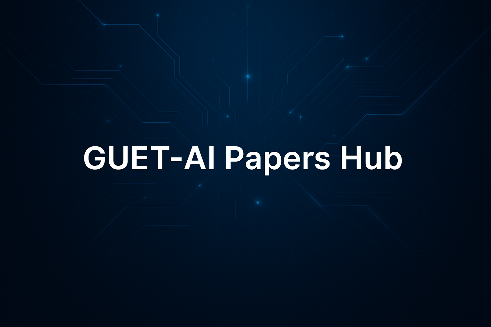

<p align="center">
  
</p>

<p align="center">
  <strong>简体中文 📄</strong> ｜ English 🌎（即将上线）
</p>

<p align="center">
  👉 欢迎教师与学生提交论文成果，一起建设 GUET-AI-Hub 平台！
</p>

---

## 👋 欢迎访问 GUET-AI 论文成果平台

在这里，您可以浏览和获取由桂林电子科技大学师生整理与贡献的各类人工智能方向的论文、技术报告和科研成果。

平台致力于为 AI 研究者提供统一格式的论文资料存档与引用资源，涵盖已发表论文、预印本、毕业论文、科研文档等，支持下载、引用、复用与交流。

您可以：
- ✅ 浏览论文条目与研究介绍
- ✅ 下载 PDF 文件和 BibTeX 引用格式
- ✅ 提交并展示您已发表或撰写的 AI 相关论文

---

## 📥 上传方式

欢迎您通过以下方式上传您的论文资源：

- ✅ [点击填写论文提交表单](https://github.com/GUET-AI-Hub/AI-Papers/issues/new?template=create_paper.yml)
- ✅ Fork 本仓库 → 上传论文文件夹 → 提交 Pull Request（PR）
- ✅ 将文件打包发送至管理员邮箱，由平台协助上传

📁 推荐目录结构如下：
```
Paper_姓名_年份_关键词
├── README.md # 简要介绍与引用说明
├── paper.pdf # 正文 PDF 文件
├── bibtex.txt # BibTeX 引用格式
└── code_link.txt # 代码链接（可选）
```

📘 不熟悉 Fork 操作？  
👉 [点击查看 Fork + PR 上传详细说明](https://github.com/GUET-AI-Hub/.github/blob/main/profile/help%20doc.md)

---

## 📮 联系方式

如您有任何建议或希望上传论文资源，请联系平台管理员：

- 👤 管理员：王学敏  
- 📮 邮箱：wangxuemin@guet.edu.cn  
- 🔗 GitHub主页：[GUET-AI-Hub](https://github.com/GUET-AI-Hub)

---

<div align="center">
  <sub>由 GUET-AI-Hub 维护 · 汇聚AI科研论文 · 推动成果共享与开放学术传播</sub>
</div>

